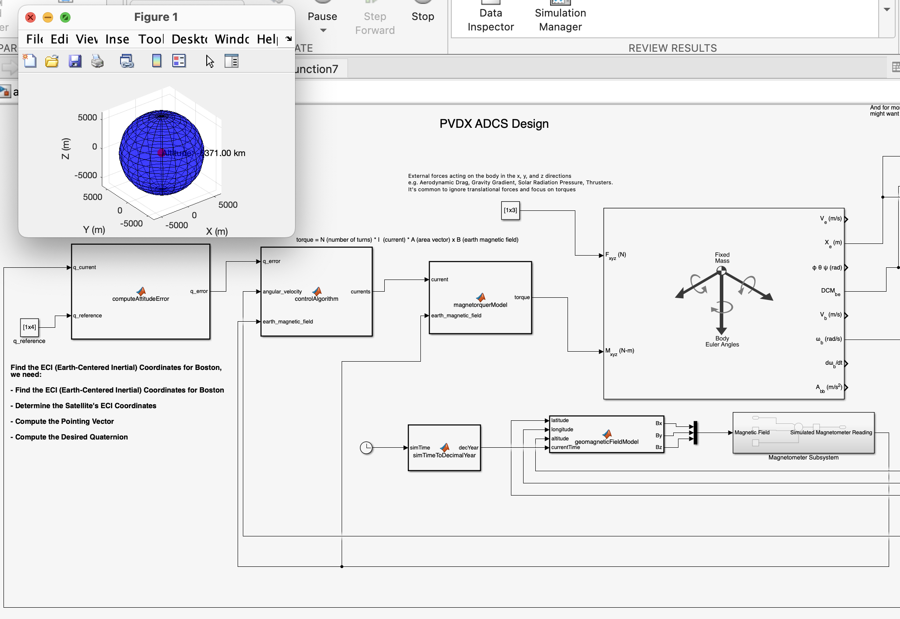

# PVDX ADCS Simulink
-----

## Contents

- [Summary](#summary)
- [What Has Been Implemented](#what-has-been-implemented)
- [How to Run](#how-to-run)

## Summary

## What Has Been Implemented
- `computeAttitudeError`: take current and reference quaternion and compute the error quaternion
- `controlAlgorithm`: take error quaternion, angular velocity, earth magnetic field and compute the desired magnetic moment and current
- `magnetorquerModel`: use current and earth magnetic field passed in to generate torque, a more detailed model can be viewed at [ADCS_MODEL_2_0.py](/ADCS_MODEL_2_0.py) or [magnetorquer_model.py](/magnetorquer_model.py)
- `Magnetormeter Subsystem`: obtain the time of the year and geomagnetic field model and calculate the current attitude quaternion
- `DCMtoQuaternion`: convert Direction Cosine Matrix to quaternion to avoid gimbal lock
- `ECEFtoLLA`: a simplified version to transform satellite position in Earth inertia frame to latitude, longitude and attitude, and then feeds these data to `Magnetormeter Subsystem`
- `6DoF`: built-in satellite module, input external force and torque, output current position, Euler Angel, DCM, angular velocity, etc.
- `visualizeSatellite`: CubeSat orbiting visualization

## How to Run
- Install `MATLAB` with `Simulink` and `Aerospace Toolbox` packages. The version I use is `MATLAB_R2023b`.
- Run [adcs_20231001_beforerun.mat](adcs_20231001_beforerun.mat) first, this creates an Earth-centered spatial grid for visualization.
- Then, run the Simulink file [adcs_visual_20230921.slx](adcs_visual_20230921.slx).
- To visualize the CubeSat orbiting, click the `visualizeSatellite` block at the very right side, and then hit the `Run` button. This will give you the orbiting simulation.
- To stop the animation, hit the `Stop` button.